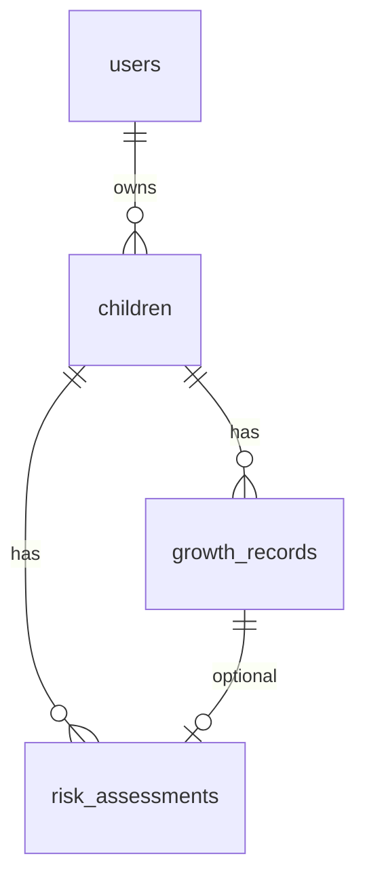

# NOVA Database Schema

PostgreSQL MVP. Migrations in `web-development/Backend/migrations/` (node-pg-migrate).

Related: [API_CONTRACT.md](./API_CONTRACT.md) · [SYSTEM_ARCHITECTURE.md](./SYSTEM_ARCHITECTURE.md)

---

## Tables

| Table | Status | Purpose |
|-------|--------|---------|
| users | Done | Parent accounts |
| children | TODO | Child profiles |
| growth_records | TODO | Measurements |
| risk_assessments | TODO | Model output |

---

## ER diagram



---

## users (existing)

Migration: `1779287769459_create-table-users.js`

| Column | Type |
|--------|------|
| id | SERIAL PK |
| name | TEXT NOT NULL |
| email | TEXT UNIQUE NOT NULL |
| password | TEXT NOT NULL |
| created_at | TIMESTAMP default now() |

---

## children (TODO)

| Column | Type |
|--------|------|
| id | SERIAL PK |
| user_id | INT FK users CASCADE |
| name | TEXT NOT NULL |
| date_of_birth | DATE NOT NULL |
| gender | TEXT NOT NULL |
| created_at | TIMESTAMP default now() |

Index: (user_id)

---

## growth_records (TODO)

| Column | Type |
|--------|------|
| id | SERIAL PK |
| child_id | INT FK children CASCADE |
| height_cm | NUMERIC(5,2) NOT NULL |
| weight_kg | NUMERIC(5,2) NOT NULL |
| measured_on | DATE NOT NULL |
| source | TEXT default manual |
| created_at | TIMESTAMP default now() |

Indexes: (child_id), (child_id, measured_on DESC)

---

## risk_assessments (TODO)

| Column | Type |
|--------|------|
| id | SERIAL PK |
| child_id | INT FK children CASCADE |
| growth_record_id | INT FK growth_records SET NULL |
| risk_category | TEXT NOT NULL |
| probabilities | JSONB NOT NULL |
| model_version | TEXT NOT NULL |
| created_at | TIMESTAMP default now() |

Index: (child_id, created_at DESC)

---

## Run migrations

```bash
cd NOVA/web-development/Backend
npm run migrate:up
```

Requires .env: DB_USER, DB_PASSWORD, DB_HOST, DB_PORT, DB_NAME

---

## Queries

Latest measurement:

```sql
SELECT * FROM growth_records
WHERE child_id = $1
ORDER BY measured_on DESC, created_at DESC LIMIT 1;
```

User children:

```sql
SELECT * FROM children WHERE user_id = $1 ORDER BY created_at DESC;
```

---

## ML appendix

CSV: mecine-learning-ai/dataset/data_bersih.csv (local)
Target: Risk_Category (stunting_deep_learning.py)
Export feature_columns.json with model artifacts.

---

## MVP rules

- Scope by children.user_id = JWT id
- source = manual only
- No photo/CV columns
- probabilities as JSONB for UI history
