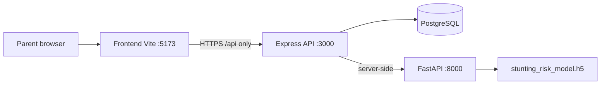

# NOVA System Architecture

MVP architecture for capstone demo. **Timeline: less than 2 weeks.** No folder restructure required.

Related: [CONTEXT.md](./CONTEXT.md) · [API_CONTRACT.md](./API_CONTRACT.md) · [DATABASE_SCHEMA.md](./DATABASE_SCHEMA.md)

---

## Purpose

Help parents monitor child growth and surface **stunting risk** early using manual anthropometry and a trained classifier—not camera-based measurement in MVP.

---

## System context



---

## Repository layout (current)

```text
NOVA/
├── web-development/
│   ├── Frontend/          # React + Vite
│   └── Backend/           # Express + node-pg-migrate
├── mecine-learning-ai/
│   ├── notebooks/         # Training & R&D
│   └── ai-service/        # NEW — FastAPI (add here)
└── docs/                  # This documentation
```

| Component | Responsibility |
|-----------|----------------|
| **Frontend** | UI, forms, JWT in localStorage, calls Express only |
| **Express** | Auth, ownership checks, CRUD, orchestrates AI, persists results |
| **PostgreSQL** | Users, children, measurements, risk history |
| **FastAPI** | Load model + preprocessors; return prediction JSON |
| **Notebooks** | Train/export .h5 and artifact files (not runtime) |

---

## Request flows (MVP)

### Auth (implemented)

1. POST /api/auth/register or login
2. Frontend stores accessToken
3. Protected routes send Authorization: Bearer token

### Assess risk (to implement)

1. Parent saves measurement → growth_records
2. POST /api/children/:id/assess-risk
3. Express builds feature payload from DB
4. Express POST to FastAPI /predict/risk
5. Express saves risk_assessments → returns to UI

On AI failure: HTTP 502, use transaction (no partial save).

---

## Service ports (local)

| Service | Port | Env hint |
|---------|------|----------|
| Frontend | 5173 | VITE_API_URL or Vite proxy |
| Express | 3000 | PORT, DB_*, ACCESS_TOKEN_KEY, AI_SERVICE_URL |
| FastAPI | 8000 | MODEL_PATH, artifact paths |
| PostgreSQL | 5432 | DB_* |

---

## Security (MVP)

- bcrypt passwords, JWT 3h TTL
- Child rows filtered by user_id from JWT id
- FastAPI not exposed to browser
- Optional AI_INTERNAL_KEY between services
- Demo: JWT in localStorage (httpOnly cookies later)

---

## ML artifacts

Path: NOVA/mecine-learning-ai/artifacts/ (gitignored)

| File | Role |
|------|------|
| stunting_risk_model.h5 | Keras model |
| scaler.pkl | StandardScaler |
| label_encoder.pkl | Labels |
| feature_columns.json | Inference column order |

---

## Deployment (demo)

| Target | Service |
|--------|---------|
| Vercel | Frontend |
| Render/Railway | Express + FastAPI |
| Neon/Supabase | PostgreSQL |

---

## Phases

| Phase | Scope |
|-------|--------|
| MVP | Manual data + tabular model + dashboard |
| Phase 2 | CV height, WHO Z-score display |
| Phase 3 | Mobile, reminders, education |

---

## Non-goals (this sprint)

Monorepo tooling, required Docker, browser→AI calls, prod retraining.

---

## Risks

| Risk | Mitigation |
|------|------------|
| Missing scaler/encoder | Export in training script |
| authcontroller filename | Fix before Linux deploy |
| AI cold start | Preload model on startup |
| Feature drift | feature_columns.json |

---

## Schedule (< 2 weeks)

| Days | Focus |
|------|--------|
| 1–2 | Migrations, JWT, children API |
| 3–4 | FastAPI + assess-risk |
| 5–7 | Frontend flows |
| 8–9 | Health, seed, errors |
| 10 | Deploy + demo |
